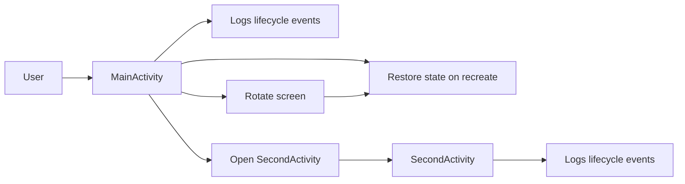

# Android Activity LifeCycle 

A simple Android app that **demonstrates the Activity lifecycle**: how `onCreate`, `onStart`, `onResume`, `onPause`, `onStop`, `onRestart`, and `onDestroy` are invoked under different user actions and configuration changes. Includes **logs**, **toasts**, and **UI state restore** with `onSaveInstanceState` and `onRestoreInstanceState`.

---

## Features

- Logs each **lifecycle callback** with clear tags
- Optional **Toast** or **Snackbar** on lifecycle events
- **State persistence** with `onSaveInstanceState` and restore after rotation
- **Second Activity** to show navigation-triggered lifecycle changes
- Simple UI controls to trigger:
  - Open second activity
  - Finish activity
  - Simulate configuration change by screen rotation
- Clean, minimal code for classroom or demo use

---

##  Tech Stack

- **Language:** Kotlin (or Java)
- **UI:** Android Views or Jetpack Compose
- **Min SDK:** 21+
- **Build:** Gradle / Android Studio

---

## Requirements

- **Android Studio** (latest stable)
- **Android SDK** 21+
- A device or emulator

---

## Setup & Run

1. **Clone**

```bash
   git clone https://github.com/ananya101001/Android-ActivityLifeCycle.git
   cd Android-ActivityLifeCycle
```

## Core Implementation (High Level)

- **Lifecycle logging**  
  Each lifecycle method logs its callback for clarity:
  ```kotlin
  private const val TAG = "MainActivity"

  override fun onCreate(savedInstanceState: Bundle?) {
      super.onCreate(savedInstanceState)
      setContentView(R.layout.activity_main)
      Log.d(TAG, "onCreate")
  }
  override fun onStart()   { super.onStart();   Log.d(TAG, "onStart") }
  override fun onResume()  { super.onResume();  Log.d(TAG, "onResume") }
  override fun onPause()   { super.onPause();   Log.d(TAG, "onPause") }
  override fun onStop()    { super.onStop();    Log.d(TAG, "onStop") }
  override fun onRestart() { super.onRestart(); Log.d(TAG, "onRestart") }
  override fun onDestroy() { super.onDestroy(); Log.d(TAG, "onDestroy") }
  ```
- **State persistence**
  ```kotlin
  override fun onSaveInstanceState(outState: Bundle) {
    outState.putString("message", binding.input.text.toString())
    super.onSaveInstanceState(outState)
    }

  override fun onRestoreInstanceState(savedInstanceState: Bundle) {
      super.onRestoreInstanceState(savedInstanceState)
      binding.input.setText(savedInstanceState.getString("message", ""))
  }
  ```
## Architecture Diagram



  

